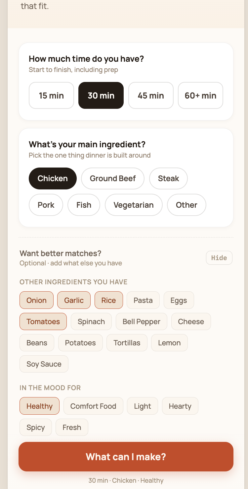
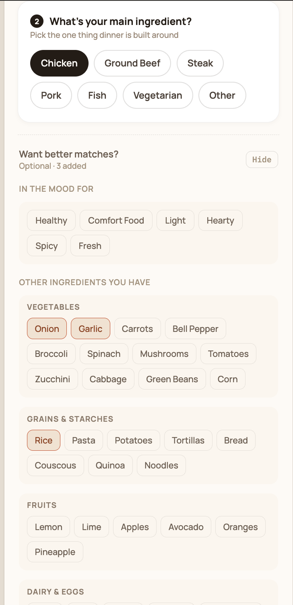

# MakeDo — Three-Screen Prototype

MakeDo is a mobile-first prototype designed to help people answer a common question: **What can I make for dinner with what I already have and the time I have available?**

Rather than creating a complete meal-planning product, this prototype focuses on one core journey: **tell MakeDo what you are working with → compare realistic dinner options → make the selected meal.**

**Prototype Link:** https://first-three-screens-ieasxafya-byu12.vercel.app

## 1. Core Hypothesis

### Need
People who cook at home struggle to decide what to make for dinner with the food they already have, often requiring extra planning, last-minute grocery trips, or spending more money eating out.

### Persona
Young couples and families who cook dinner at home several nights a week and juggle busy work, school, or family schedules. They often decide what to make during the day or shortly before dinner and want to avoid unnecessary grocery trips.

### Primary Capability
Decide what to make for dinner based on the food they already have, their available time, and their preferences.

### Fundamental Value — Control
Users know what they are making for dinner ahead of time, allowing them to spend less time deciding, avoid last-minute scrambling, and fit dinner into their schedule.

---

## 2. The Three Screens

### Screen 1 — Dinner Input / Home
**Single job:** Communicate the product's core value and let users quickly provide the minimum information needed to receive relevant dinner ideas.

**Why it earned a slot:** This screen lets users immediately begin solving the dinner-decision problem without requiring a lengthy setup or complete inventory of their kitchen.

**Design question:** Can a first-time user quickly understand that they can find dinner ideas based on the ingredients and time they already have?

### Screen 2 — Dinner Options
**Single job:** Help users quickly compare a small number of realistic dinner options and choose one that works tonight.

**Why it earned a slot:** This screen demonstrates the primary capability by turning the user's time and available ingredients into a manageable set of dinner choices instead of another large recipe database.

**Design question:** Can users quickly identify which dinner option best fits their time and available ingredients without having to research and compare recipes themselves?

### Screen 3 — Recipe
**Single job:** Help the user confidently turn their selected dinner option into an actual meal.

**Why it earned a slot:** This completes the core journey by moving the user from deciding what to eat to knowing exactly what ingredients and steps are needed to make it.

**Design question:** Once users choose a meal, can they immediately understand what they need and how to make it without needing another source?

---

## 3. Design Question Plan

### Need
**Question:** When you're trying to decide what to make for dinner, what usually makes you give up on cooking and just order food or do something else instead?

**Prediction:** People will say they give up when deciding takes too long, they cannot figure out what they can make with what they have, or recipes require ingredients they do not have.

**Based on:** The Home screen minimizes required input by asking for time and a main ingredient first, while making additional ingredients and preferences optional.

### Value
**Question:** If you had something that made figuring out dinner like this easier, what would be the biggest benefit to you? If you had to describe that benefit in one or two words, what would you say? Why?

**Prediction:** Users will say something like **control, time, or less stress** because they can make a decision without spending a lot of time searching or making an unnecessary grocery trip.

**Based on:** Dinner Options shows a small number of relevant meals and communicates what the user already has, what is missing, and possible substitutions.

### Persona
**Question:** Who else in your life do you think has the same problem of trying to figure out what to make for dinner with what they already have?

**Prediction:** Users will mention spouses/partners, young couples, parents, students, or people balancing busy work and school schedules.

**Based on:** The experience is intentionally designed around quick dinner decisions for people who cook at home but have limited time for meal planning.

### Capability
**Question:** Looking at this first screen, what would you tap first, and what would you expect to happen after you tap it?

**Prediction:** Users will select their available time, then their main ingredient, and expect **"What can I make?"** to produce dinner ideas that fit those choices.

**Based on:** The Home screen numbers time as Step 1 and main ingredient as Step 2, makes additional information optional, and gives "What can I make?" the strongest action hierarchy.

---

## 4. Design Justification and First Read

### Signaling the capability and value
The landing screen uses **"Your ingredients. Your time. Your dinner."** as its dominant affordance sentence. Its size, position, and contrast create a clear visual hierarchy before the user reads the supporting explanation. The numbered inputs then signal the primary capability: provide the time available and the main ingredient to find a dinner.

The fundamental value of **control** is less literal but is supported by the structure of the experience. Rather than asking users to search through recipes, the interface asks for their current constraints and returns a limited set of options that fit them.

### Does every element earn its place?
The two required inputs—time and main ingredient—receive the strongest grouping and visual emphasis because they are the minimum information needed to use the prototype. **"Want better matches?"** is intentionally visually secondary and labeled optional so additional preferences do not compete with the primary path.

The large **"What can I make?"** button acts as the primary call to action and clearly signals what happens after the inputs are selected.

### Gestalt grouping
The interface relies heavily on **proximity, common region, and similarity**.

- On Screen 1, time options and main ingredients are placed in separate cards using common region and proximity, communicating that they are two distinct input groups.
- Optional mood and ingredient selections are grouped by category, such as vegetables and grains/starches, making a longer list easier to scan.
- On Screen 2, each dinner is contained within its own card. Ingredient availability and missing ingredients are grouped within that meal rather than displayed separately.
- On Screen 3, recipe information is divided into overview, ingredients, substitutions, and instructions. The missing ingredient and its substitute share a common region so the relationship between them is immediately visible.

### Keeping Screens 2 and 3 on mission
**Screen 2** stays focused on comparison. Cooking time, ingredients already available, missing ingredients, and substitutions answer whether a meal realistically works tonight. Progressive disclosure allows users to reveal specific ingredients without making every card overwhelming.

**Screen 3** stays focused on execution. Exact measurements, substitutions, and numbered instructions provide what the user needs to make the selected meal. Navigation allows the user to return to Dinner Options or Home without restarting unexpectedly.

### Before-and-After Revision

**Before:**  

In the initial AI-generated design, the optional **"Other ingredients you have"** section displayed all available ingredients together in one group. Although the ingredients were related by proximity and similarity, there was no additional visual structure to help users scan the growing list. This worked with a small number of ingredients, but it became harder to find a specific ingredient as more choices were added.

**After:**  

I revised this section by grouping ingredients into familiar food categories such as **Vegetables, Grains & Starches, Fruits, and Dairy & Eggs**. Each category is placed within its own visual container.

This revision uses the Gestalt principles of **common region and proximity**. Ingredients within the same category are visually grouped together, while spacing and separate containers distinguish one category from another. The change makes it easier to scan for an ingredient without requiring the user to read every option.

This decision was motivated by my Screen 1 design question:

**Can a first-time user quickly understand that they can find dinner ideas based on the ingredients and time they already have?**

Because adding additional ingredients is optional, I wanted this section to provide more control without making the primary flow feel like a lengthy inventory form. The revised grouping allows users who want better matches to provide more information while keeping that information organized and easier to navigate.